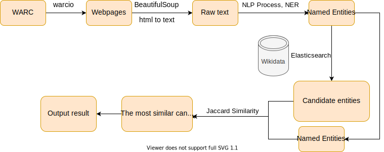

# Entity Linking
## 2020 fall Period 2 Web Data Processing System Course Assignment1 

Implement a program that receives a collection of web pages as input and returns all the entities mentioned with a link to the corresponding entity in Wikidata. Essentially, this task is to implement a entity linker.

## Implementation Procedure

    
    Figure 1. Implementation Procedure Overview

### HTML to Text
* Use **warcio** to read warc file
* Use **BeautifulSoup** to retrieve Text from Html

### NLP Process
* Use **sent_tokenize** & **word_tokenize** from **NLTK**
* (Stemming and lemmatization may affect the results of POS tagging, so I currently skip this step)
* Stop words removal
* POS tagging
* Named Entity Recognition: derive entities using **ne_chunk** in **NLTK**

### Candidate Generation
* Use **Elastic search** to get 10 potential candidates

### Candidate Ranking
* Compare the similarity between entity mention and entity candidates using **Jaccard Similarity**. 
* After deriving 10 candates' score of similarity, we will pick the one with highest similarity. However, we set a threshold for the score. If the score of the candidate less than the threshold, we will drop the candidate.
* Finally, we obtain the entity which is highest similar to entity mention, and with its score higher than the threshold we set.

## Result

|__Gold__|500|
|__Predicted__|1123|
|__Correct__|40|
|__Precision__|0.0356|
|__Recall__|0.08|
|__F1__|0.0493|
